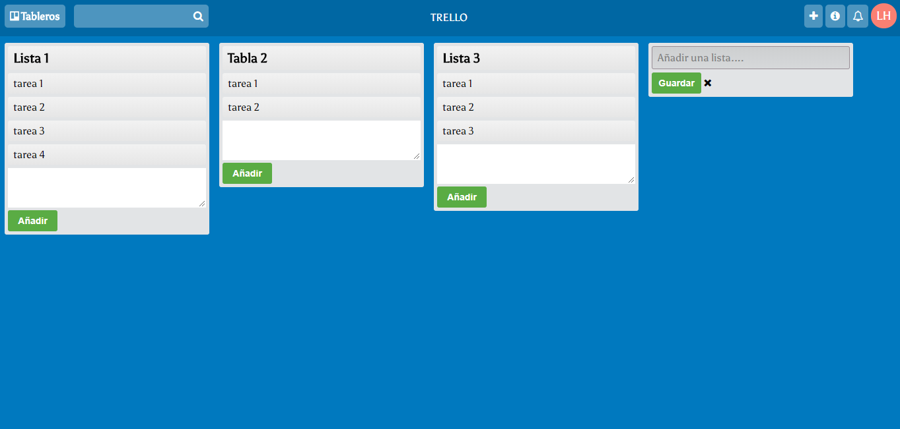

## README
1. Nombre del Proyecto:
	- Reto de Código - Trello
2. Descripción del Proyecto:
	- Este proyecto contiene una página web que simula el funcionamiento de la página web Trello
3. Herramientas utilizadas
	- HTML5
	- CSS3
	- Javascript
4. Autor:
	- Lilliam Haro (8BM)

